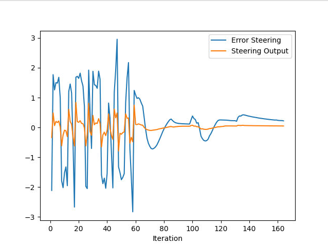
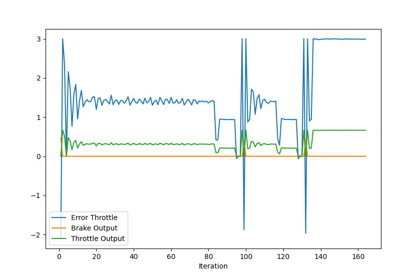
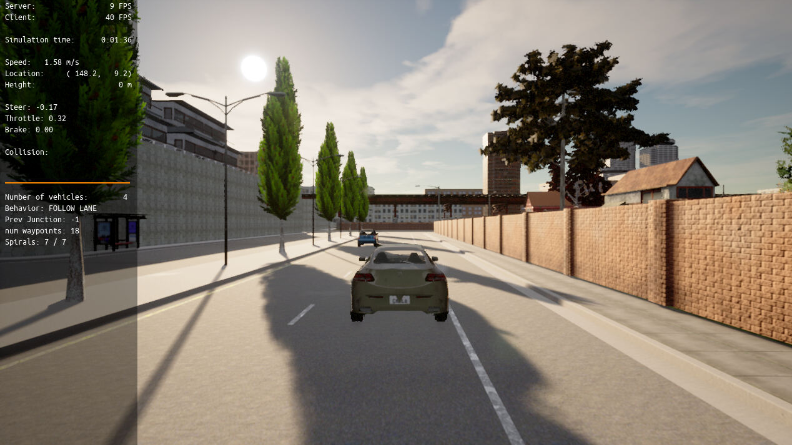
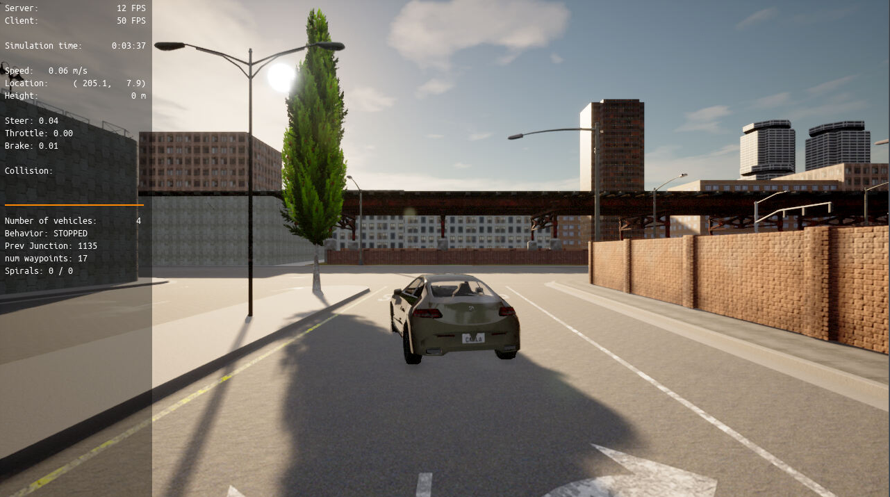

# Control and Trajectory Tracking for Autonomous Vehicles

Simulated car's steering and throttle were controlled following a given trajectory in this exercise. PID controller's parameter values were tuned to produce a collision free (with the stationary cars in the same road) and was able to drive the car towards the end of the road.

## PID for steer control

Following plot shows how the PID controller behaved for steering control. Eventually error and actual output were close enough, and there were some oscillations observed initially. Probably it needs less derivative (D) controller influence. Tried with few though.

## PID for throttle control

Following plot shows how the PID controller behaved for throttle control. Output never increased above 1 due to limiting the PID controller object in between 1 and -1. However, it seemed to compensate for the propotional error good enough. Probably with further tuning, oscillation can be reduced.

## Simulated car in action

Following screenshots shows how the simulated car with the integrated PIDs for steering and throttle control.

At the starting point, car is stationary.

Car is successfully passing the other stationary cars without colliding with them.

Simulated car reached the end of the road, and passed all other cars without colliding with them.

## What is the effect of the PID according to the plots, how each part of the PID affects the control command?
The purpose of the PID controller is to minimize the error between the desired and actual result. In order to achieve this PID controller iteratively uses propotional error between the desired and actual (Propotional, P component), sum of all the previous errors (Integral, I Component), difference between previous iteration's error and current error (Derivative, D Component). 

P value - ensures we are puttting proptional effort to compensate for the eror all the time.

I value - ensures error is integrated effort is applied.

D value - predicts the correction made by the controller and ensure overshoot not occur.

## How would you design a way to automatically tune the PID parameters?

Twiddle approach can be used for further tuning of the PID controllers for optimal results (reducing the error gap sooner, reduced oscillation and preventing overshoots and undershoots). This approach is done by holding other parameters constant except the one being varied and tuned at a them. While changing the parameter value, an optimal value can be found for the specific parameter, then move on to other parameters. This can repeated again until optimal result is reached. Probably, this process can be automated upto some level for auto-tuning.

## PID controller is a model free controller, i.e. it does not use a model of the car. Could you explain the pros and cons of this type of controller?
Model free PID controller can be used regardless of whether it is used for steering or throttle, or the type of vehicle. That means model free controllers can be generalized easily. When a specific model is adopted into the controller, it could possibly give more precision into the controller, but it will require extra effort to implement and tune the model.